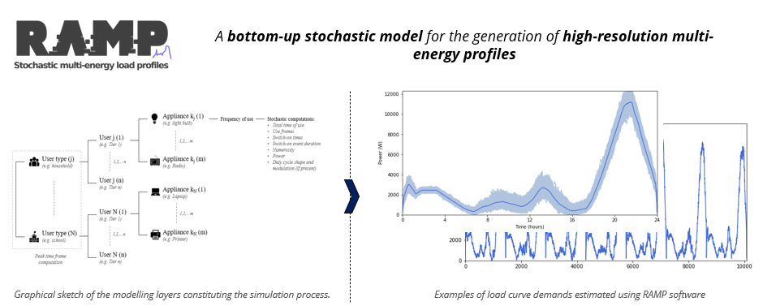

# **RAMP Load Demand Simulation – Streamlit Application**

<p align="center">
  
</p>

This is a **Streamlit-based interface** that makes the bottom-up, appliance-level load demand modelling capabilities of the **RAMP** framework accessible through a structured graphical workflow.

RAMP generates realistic, high-resolution electricity demand time series by simulating user behaviour, appliance operation, and stochastic variability at **minute-scale resolution**. Traditionally, this workflow requires detailed Excel templates and Python scripting. This application exposes the same pipeline in a transparent, guided, and reproducible environment.

The app is organised into **three complementary pages**:

1. **Inputs Editor** – build full RAMP Excel inputs directly in the interface  
2. **RAMP Simulation** – configure temporal structure and run the stochastic engine  
3. **SSA Archetypes** – generate demand profiles from empirically derived SSA archetypes  

Together, they provide a complete workflow from **appliance definition → stochastic simulation → export-ready profiles** for energy system modelling.

---

# **Application Structure**

## **1. Inputs Editor**

This page allows users to build **full RAMP-compatible Excel input files directly inside the app**, avoiding manual editing of the full template.

### Features

- Define multiple **user categories** (e.g., Households, Clinics, Schools)
- Add:
  - **Standard appliances** (functioning windows + total daily usage)
  - **Duty-cycle appliances** (cycle segments and admissible cycle windows)
- Validate appliance timing via **hourly heatmap visualisation**
- Automatically compile a **full RAMP template workbook**
- Download a ready-to-run Excel file

The editor uses **user-friendly (“pretty”) column names**, internally mapped to canonical RAMP parameter names through a structured schema layer. Missing optional parameters are automatically filled with consistent defaults.

This page is recommended as the starting point for new projects.

---

## **2. RAMP Simulation**

This page runs the **full stochastic RAMP workflow**.

### Step 1 – Temporal Structure

Users define the structure of the synthetic year:

- **Number of seasons** (1–4)  
- Custom **month allocation per season**
- Optional **within-week differentiation**:
  - Weekday vs Weekend
  - Custom week-classes (up to 7)

Each *(Season × Week-class)* combination becomes an **archetype**, representing a stochastic pool of daily profiles.

### Step 2 – Upload Full RAMP Inputs

Users upload **full RAMP Excel files**:

- **Single-archetype mode**  
  One input governs the entire year.

- **Multi-archetype mode**  
  One full Excel file per archetype (Season × Week-class).

Unlike earlier simplified approaches, this version expects the **complete RAMP template structure**, validated internally through a schema layer.

### Step 3 – Stochastic Simulation

RAMP generates:

- Independent synthetic daily profiles per archetype
- A synthetic 365-day year assembled by sampling from archetype pools according to the calendar structure

This captures:

- **Intra-archetype stochastic variability**
- **Seasonal and weekly behavioural patterns**

### Step 4 – Visualisation & Export

Outputs include:

- Aggregated and per-category **minute-resolution profiles (365 × 1440)**
- Average daily curves with **min–max variability envelopes**
- Day-level inspection
- Filtering by season / week-class (if enabled)

Export options:

- `profile_aggregated.csv` (minute resolution)
- `profile_aggregated_hourly.csv` (8760 hourly series)
- Per-category minute profiles

The hourly profile is directly usable in optimisation, dispatch, techno-economic, and planning models.

---

## **3. SSA Archetypes**

This page provides a **rapid scenario-building pathway** based on empirically derived **Sub-Saharan Africa (SSA) demand archetypes**.

Instead of appliance inventories, users define the settlement composition:

- Households by **tier (1–5)**
- Schools
- Health facilities (5 tiers)

Climatic context is selected via latitude / cooling regime logic.

The methodology is based on:

> N. Stevanato, I. Sangiorgio, R. Mereu, E. Colombo, *Archetypes of Rural Users in Sub-Saharan Africa for Load Demand Estimation*, 2023 IEEE PES/IAS PowerAfrica.  
> https://doi.org/10.1109/POWERAFRICA57932.2023.10363287

The profiles in `config/archetypes_library/` correspond to the open dataset **v1.0.0** on Zenodo (https://doi.org/10.5281/zenodo.22832973), which also provides the RAMP inputs, 1-minute household profiles and the definitions of household and health-facility tiers. Compared with earlier versions of this app, v1.0.0 updates health-facility tiers 2–5 (2025 correction of the X-ray and cooling modelling) and household archetypes NC_F1 tiers 1–3 (re-simulated in 2026); see the dataset CHANGELOG.

This mode outputs:

- Aggregated **hourly (8760) profile**
- Per-user category profiles

It prioritises accessibility, speed, and structured scenario design for data-scarce environments.

---

# **Inputs & Outputs**

## **Inputs**

- Full RAMP Excel templates (built via the Inputs Editor or externally prepared)
- SSA archetype composition (tiers, schools, hospitals)

## **Outputs**

All outputs are written in **CSV** format:

| File | Description |
|------|------------|
| `profile_aggregated.csv` | 365×1440 aggregated RAMP profile |
| `profile_aggregated_hourly.csv` | 8760 hourly profile (RAMP) |
| `profile_<user>.csv` | Per-category minute-resolution profile (RAMP) |
| `ssa_aggregated_hourly.csv` | Hourly aggregated SSA profile |
| `ssa_<user>.csv` | Per-category SSA profile |

These files are directly compatible with:

- Mini-grid optimisation models
- Dispatch simulations
- Techno-economic assessments
- Power flow studies
- SDG7 electrification planning analyses

---

# **Installation**

### **Conda (recommended)**

```bash
conda env create -f environment.yml
conda activate ramp_streamlit
```

### **Running**

```bash
streamlit run app.py
```

Then open:

```
http://localhost:8501
```

---

# **Contact**

**Alessandro Onori**  
📧 alessandro.onori@polimi.it  

Technical Advisors  
- Riccardo Mereu — Politecnico di Milano  
- Emanuela Colombo — Politecnico di Milano

---

# **License**

European Union Public Licence (EUPL v1.1).
